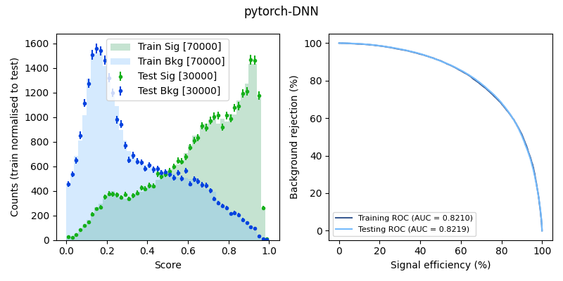
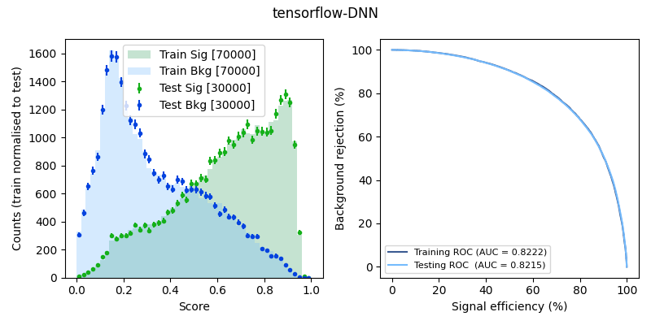
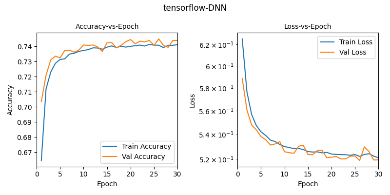
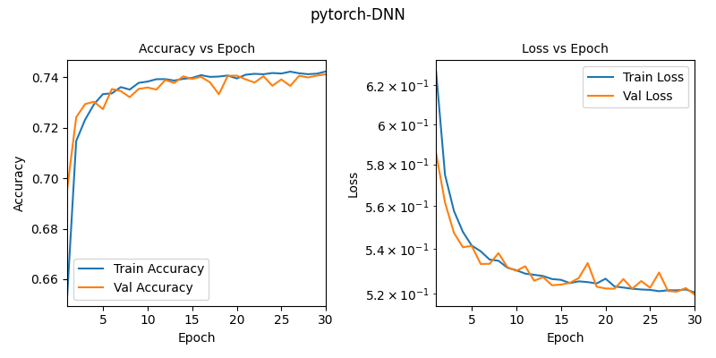
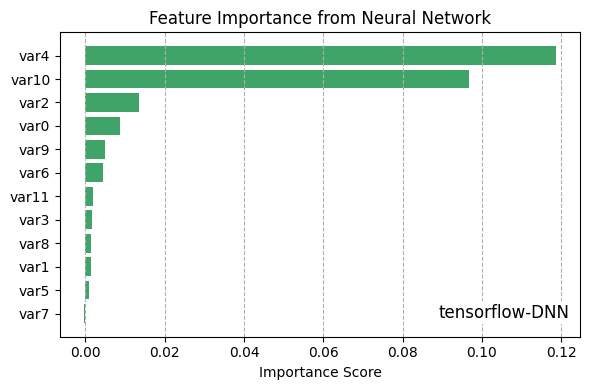
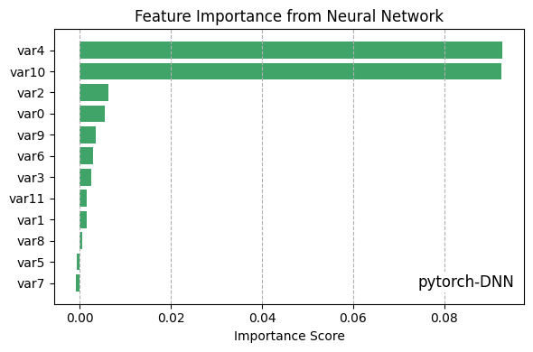

# DNN: TensorFlow or PyTorch?

[](https://www.python.org/) [](https://www.tensorflow.org/) [](https://pytorch.org/) [](https://pytorch.org/vision/stable/) [](https://pytorch.org/audio/stable/) 

This repository contains example scripts for training and evaluating a simple DNN to classify physics events between WZ and ZZ processes. Two implementations are provided: **TensorFlow/Keras** and **PyTorch**.

## ✨ Features

- Train a DNN on event-level physics datasets.
- Input features are automatically min-max scaled.
- Evaluate performance with ROC curves and classification metrics.
- Optional feature importance calculation via permutation importance.
- Implemented in **TensorFlow/Keras** and **PyTorch**.
- Lightweight and easy to extend to other datasets or models.


## 🛠️ Environment Setup
Create and activate a conda environment. I picked a stable Python version.
```bash
conda create -n dnn python=3.11 -y
conda activate dnn
```
> `pip install` is preferred over `conda install` to get the latest stable versions.
```bash
pip install tensorflow==2.17.0 keras==3.4.1
pip install numpy pandas matplotlib scikit-learn tqdm
pip install torch torchvision torchaudio
```
Alternatively, you can install the `dnn_environment.yaml` file. The total size taken by this environment in my system is around 9 GB, containing both TensorFlow and PyTorch.

## 📂 Directory Structure
```bash
├── input_datasets
│   ├── input_WZ.txt          # WZ event data
│   └── input_ZZ.txt          # ZZ event data
├── train_pytorch_DNN.py      # PyTorch DNN script
├── train_tensorflow_DNN.py   # TensorFlow DNN script
└── trained_models            # Saved models and performance plots
```
`trained_models` is automatically created during training. Stores trained model weights and performance plots. 

## ▶️ Running the example scripts
TensorFlow/Keras version
```bash
python3 train_tensorflow_DNN.py
```
PyTorch version
```bash
python3 train_pytorch_DNN.py
```


## 📊 Results


### Performance
|  TensorFlow | PyTorch |
|-------------|----------------|
 |  |

### Loss and accuracy
| TensorFlow | PyTorch |
|-------------|----------------|
|  |    |

### Feature Importance
| TensorFlow | PyTorch |
|-------|------------------|
|  |    |

